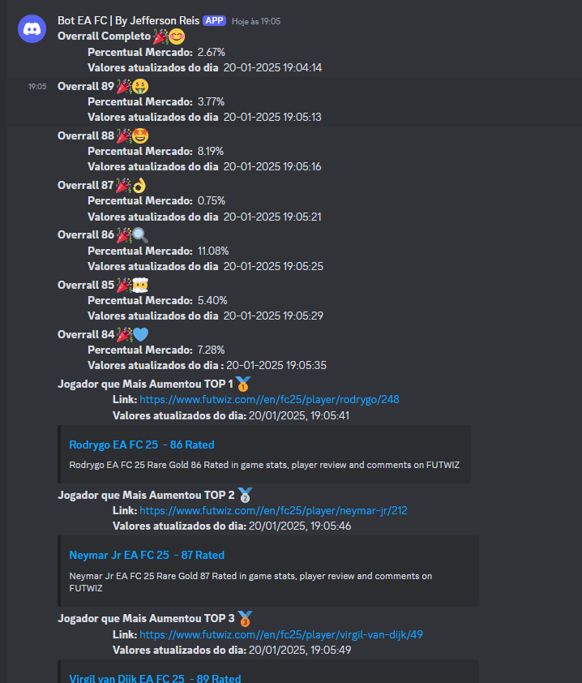

# Análise do Mercado EA FC 25 - Projeto de Automação com Cypress com interações com Bot DISCORD

Este projeto é um conjunto de scripts automatizados utilizando o framework **Cypress** para realizar análises e capturas de dados de um mercado de jogadores de futebol, focando em várias classificações e estatísticas. O objetivo é coletar informações como o percentual do mercado e os jogadores mais vendidos, registrando esses dados em arquivos CSV e enviando atualizações através de Webhooks.

## Funcionalidades

- **Coleta de dados do mercado geral e das classificações específicas (84 a 89)**: O projeto captura as informações do percentual do mercado em diferentes páginas, sendo atualizado em tempo real.
- **Armazenamento de dados em formato CSV**: Para cada captura de dados, as informações são salvas em arquivos CSV localizados no diretório `cypress/fixtures/`.
- **Envio de notificações via Webhook**: Após capturar os dados, uma notificação é enviada via Webhook com as informações coletadas e formatadas, com um link direto para a página do jogador mais vendido no momento.
- **Extração de Links dos Jogadores Mais Vendidos**: O projeto também faz a extração do link dos jogadores mais vendidos e os envia para o Webhook.

## Tecnologias e Bibliotecas Utilizadas

- **Cypress**: Framework de testes de front-end utilizado para automação de navegação, captura de dados e verificações de status.
- **csv-stringify**: Biblioteca para manipulação e criação de arquivos CSV, utilizada para salvar os dados coletados em formato estruturado.
- **Webhooks**: Utilizados para enviar dados capturados para um servidor externo de maneira automatizada.
- **JavaScript (ES6+)**: Utilizado para toda a lógica do projeto, incluindo captura de dados e formatação de datas.

## Estrutura do Código

O código está estruturado com diferentes comandos do **Cypress** que podem ser reutilizados para capturar dados de diferentes páginas do mercado:

- **Comando `AnaliseMercadoGeral`**: Captura o percentual do mercado geral e envia as informações via Webhook.
- **Comandos de análise para diferentes classificações** (e.g., `AnaliseMercadoRating84`, `AnaliseMercadoRating85`, etc.): Cada um desses comandos captura o percentual do mercado em páginas específicas relacionadas a classificações de jogadores (rating de 84 até 89).
- **Comandos `Top1MaisVendido`, `Top2MaisVendido`, `Top3MaisVendido`**: Extraem o link do jogador mais vendido em cada uma dessas posições e enviam o link via Webhook.

## Como Executar

1. Clone este repositório para o seu ambiente local:

   ```bash
   git clone https://github.com/seu-usuario/analisemercado.git
   ```

2. Instale as dependências do projeto:

```bash
npm install
```

3. Configure as variáveis de ambiente no arquivo environment.js:

* webhookUrl: URL do seu Webhook para receber as notificações.
* url: URL da página principal do mercado para começar a análise.

4. Execute os testes com Cypress:

Para abrir o Cypress:

```bash
npx cypress open
```
Ou para rodar os testes em modo headless:
```bash
npx cypres run
```

## Como Funciona

* Acesso ao Mercado: O script visita a URL principal do mercado ou URLs específicas com base na classificação do jogador (e.g., rating 84, 85, etc.).
* Captura de Dados: Utilizando seletores definidos no arquivo locators.js, o Cypress captura o percentual de mercado exibido nas páginas.
* Armazenamento e Notificação: Os dados são então armazenados em arquivos CSV e, em seguida, enviados para um Webhook configurado. O corpo da notificação inclui o percentual do mercado e a data/hora da atualização.

# Imagens do bot Discord.


